# Eval charts

Generated by `scripts/render_report_charts.py` from `web/data/snapshot.json` (snapshot 2026-09-27T11:20:54+00:00). The same SVGs are served by the viewer's Charts tab.

## Extraction score by document type

## Per-document extraction scores

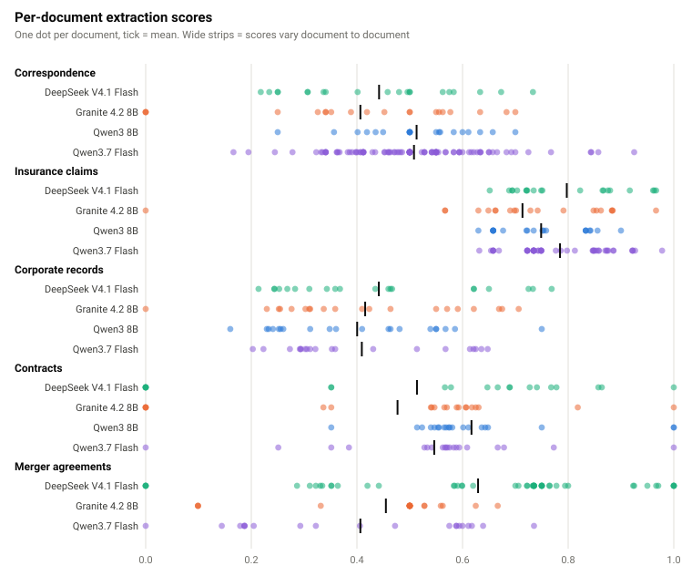

## Extraction score by subclass

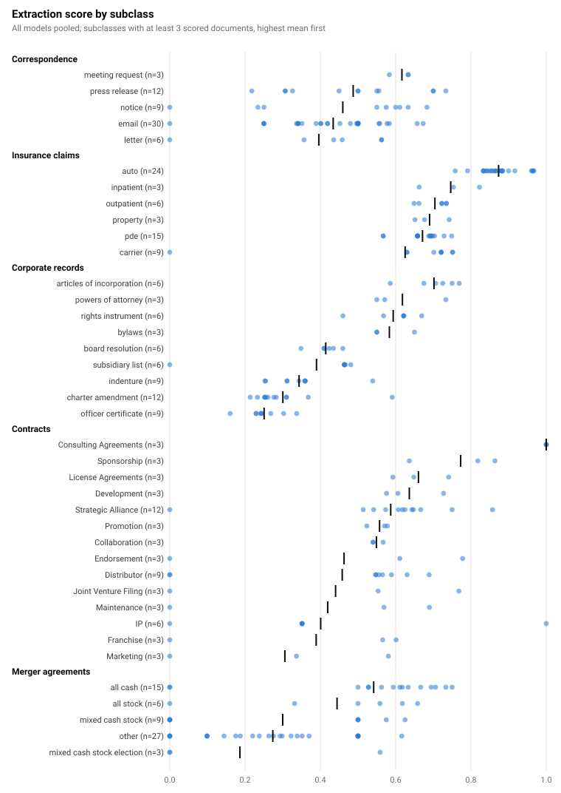

## API cost per document

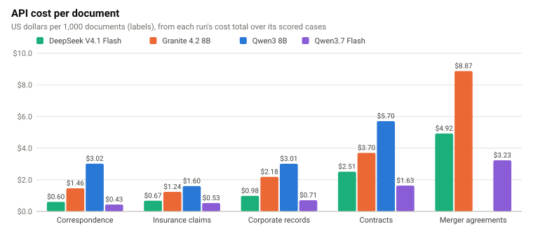

## LLM sorter confusion matrix · DeepSeek V4.1 Flash

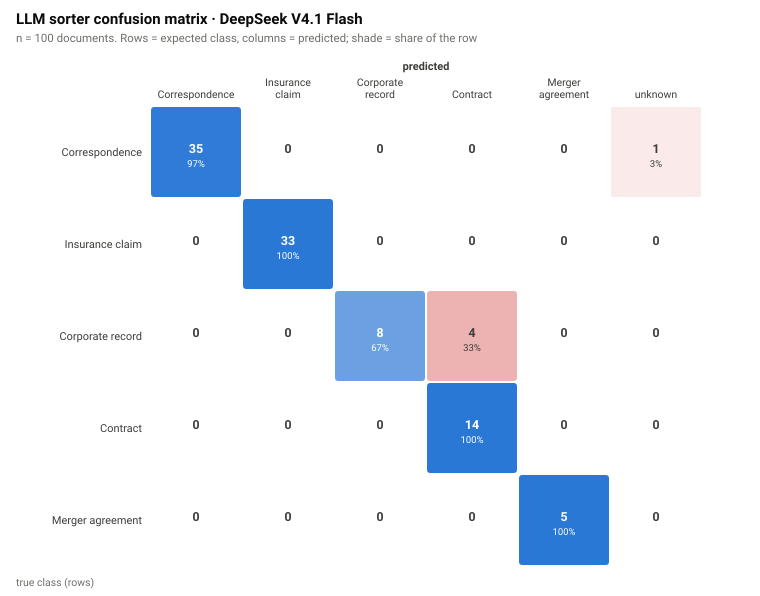

## LLM sorter confusion matrix · Granite 4.2 8B

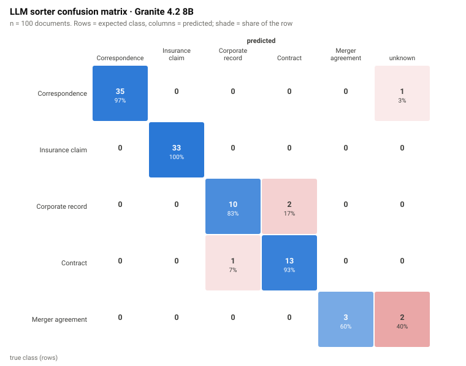

## LLM sorter confusion matrix · Qwen3.7 Flash

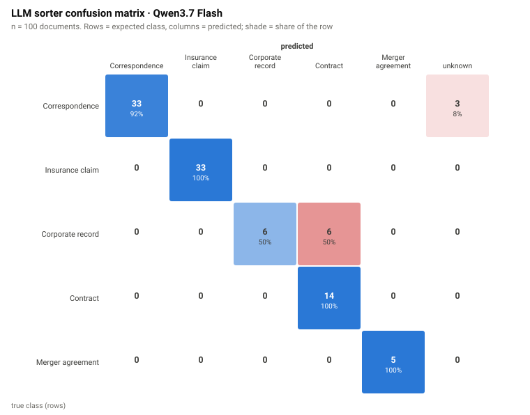

## LLM sorter subclass accuracy

## LLM sorter collapse signal

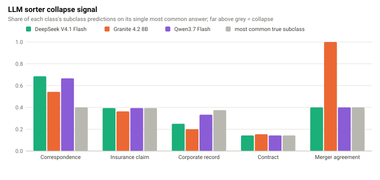

## LLM sorter calibration

## ALE: latency on extraction score · Correspondence

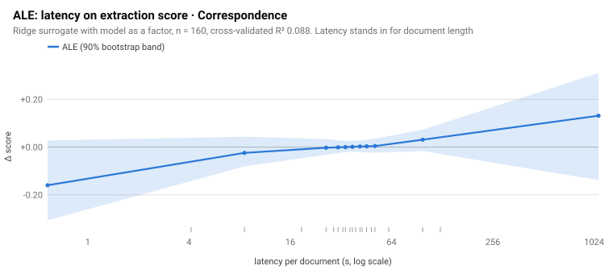

## ALE: latency on extraction score · Insurance claims

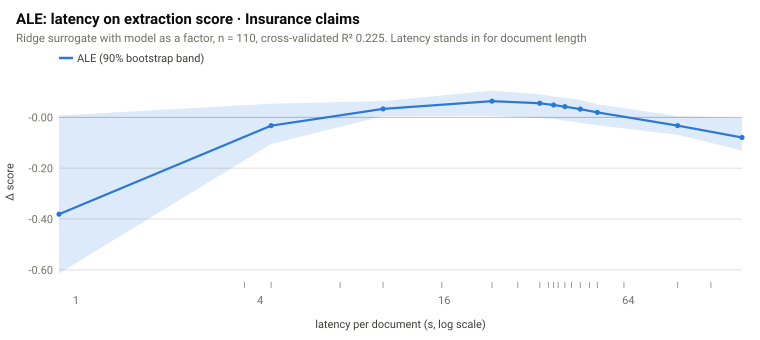

## ALE: latency on extraction score · Corporate records

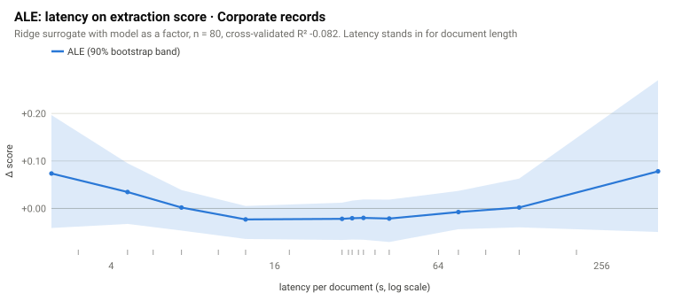

## ALE: latency on extraction score · Contracts

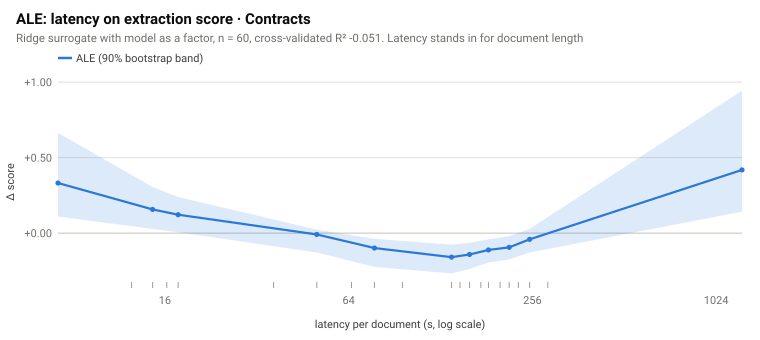

## ALE: latency on extraction score · Merger agreements

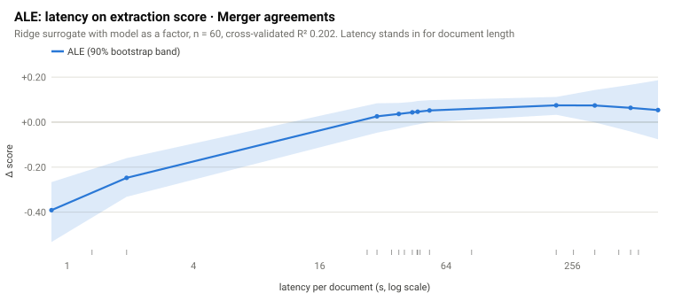
